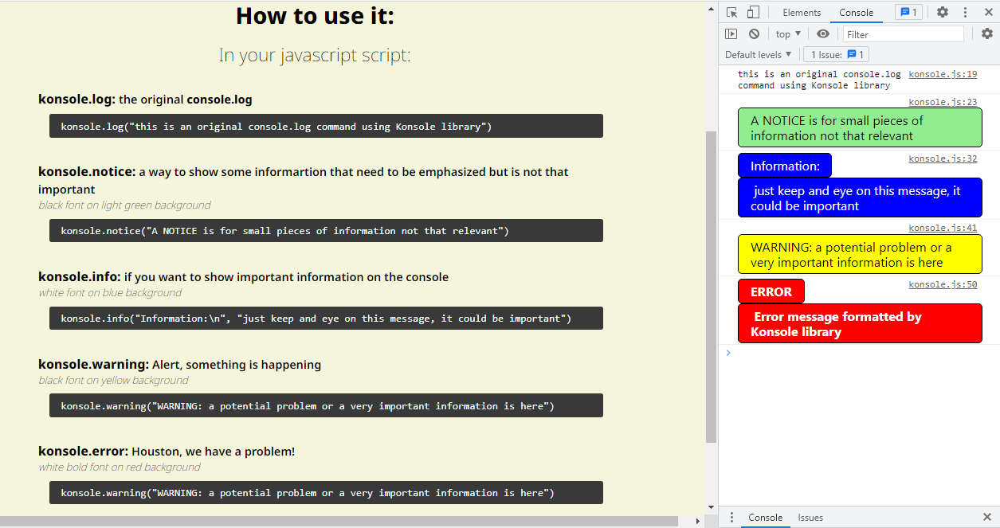

# Konsole
### an easy way to give ife to *console.log* in the browser

You have 5 levels of information in this library:
- ***log***: the same as the regular console.log
- ***notice***: black on green, for general information
- ***info***: white on blue, for important information
- ***warning***: black on yellow, critical or potential problems
- ***error***: white bold on red, to show really big problems

See *konsole.html* for more information.

Please let me know your comments!
